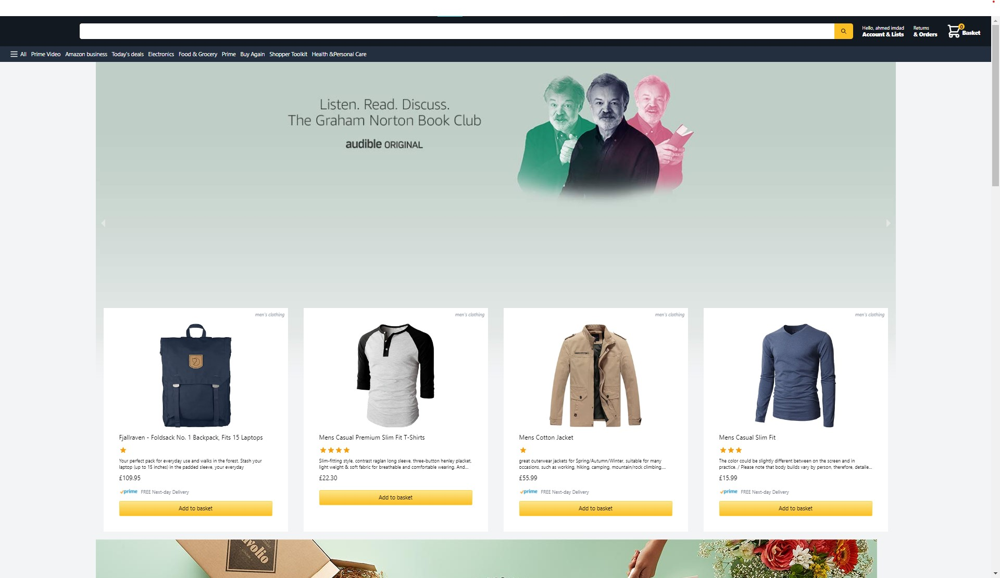

#  An Amazon Clone built with React and Next 

## Table of contents

- [Overview](#overview)
  - [The challenge](#the-challenge)
  - [Screenshot](#screenshot)
  - [Links](#links)
- [My process](#my-process)
  - [Built with](#built-with)
- [Author](#author)
- [Acknowledgments](#acknowledgments)

## Overview

- This is an Amazon clone built with React and NextJS which uses TailwindCSS for styling and supports Server-side rendering.

### The challenge

- This was my first project with NextJS. Learnt a lot about NextJs and its prebuilt functionalities like server-side rendering, file-based routing system, image optimization with next/image and NextAuth. Hope to know more about this amazing React Framework in future. 

### Screenshot

### Links

- Solution URL: [solution](https://github.com/imdadulahmed1593/amz-clone-next)
- Live Site URL: [live link](https://amzn-clone-next.vercel.app/)

## My process

### Built with

- NextJS
- TailwindCSS
- NextAuth
- Firebase

## Author

- Website - [Ahmed Imdad](https://ahmedimdad93.netlify.app/)
- Frontend Mentor - [Ahmed Imdad](https://www.frontendmentor.io/profile/imdadulahmed1593)
- Facebook- [Ahmed Imdad](https://www.facebook.com/ahmed.imdad.5/)

## Acknowledgments

I would like to acknowledge myself for this amazing project :v
